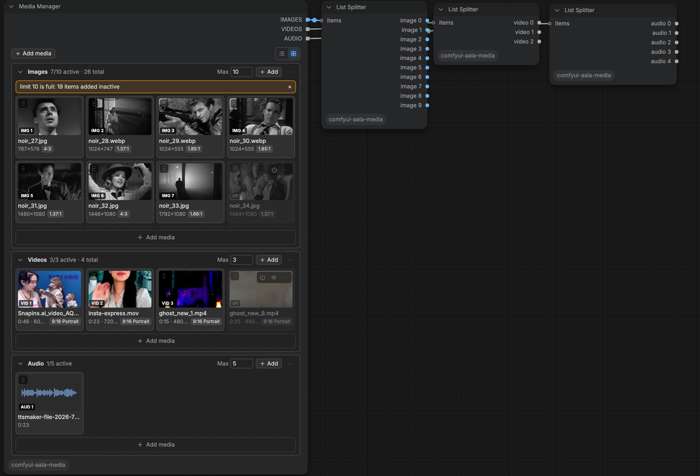
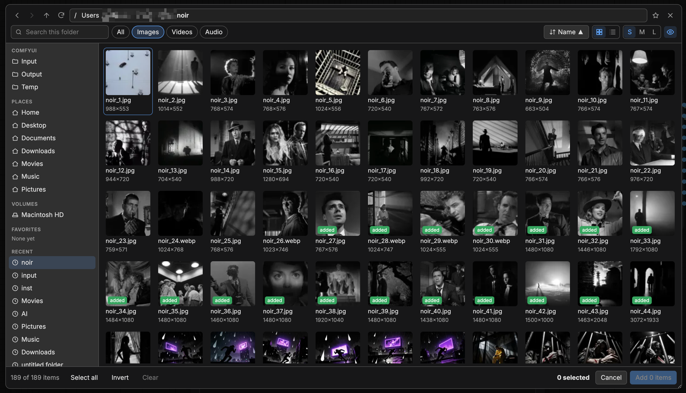

# ComfyUI-AALA-nodes

AALA node pack for ComfyUI. Nodes appear under **AALA Nodes** in the Add Node menu.

## AALA Nodes

The nodes we built for us.

### AALA Media Manager

`AALA Nodes/media`



- Collects images, videos and audio from any folder on the machine running ComfyUI. The file browser opens at ComfyUI's input folder and offers places, a path bar, grid and list views, sort, search, kind filters and multi-select across folders.
- Files are referenced in place by path; nothing is copied into `input/`.
- Three groups (Images, Videos, Audio), each with its own order, a max active limit and a scrolling list. Items can be switched off, muted, reordered, previewed and relinked when missing.
- Outputs `IMAGES`, `VIDEOS` and `AUDIO` as lists of the active items, in group order. Missing or unreadable files are skipped and flagged in the node.
- Works in canvas mode and Vue Nodes mode; state is saved with the workflow and supports undo, redo and copy-paste. Notices are shown inline in the node.



The browser can read any file the ComfyUI process can read. This is intended; keep ComfyUI off shared networks unless that is acceptable.

### AALA List Splitter

`AALA Nodes/utils`

- Turns any list into one output per item, labelled by type (`image 0`, `image 1`, ...). Slots with no item output `None`.
- Linked to a Media Manager output, the number of outputs follows that group's max active limit. Linked to any other list, the count is set on the node.

### AALA Get Video Components

`AALA Nodes/media`

- Same outputs as core Get Video Components: images, audio, fps, bit depth, color space.
- An empty input, such as an unused List Splitter slot, never fails the run. **If empty** chooses what happens: `pass None` (default, for optional model inputs) or `skip downstream` (nodes using the outputs, such as Preview or Save, are skipped silently).

## Install

Clone into `ComfyUI/custom_nodes/`. The built frontend (`web/dist/aala-media.js`) is committed, so no build step is needed.

## Development

```
cd frontend
npm install
npm run build      # type-checks, then writes web/dist/aala-media.js
npx vitest run     # frontend unit tests
```

Python tests (from the package root, using the ComfyUI Python environment):

```
python -m unittest discover -s tests
```
